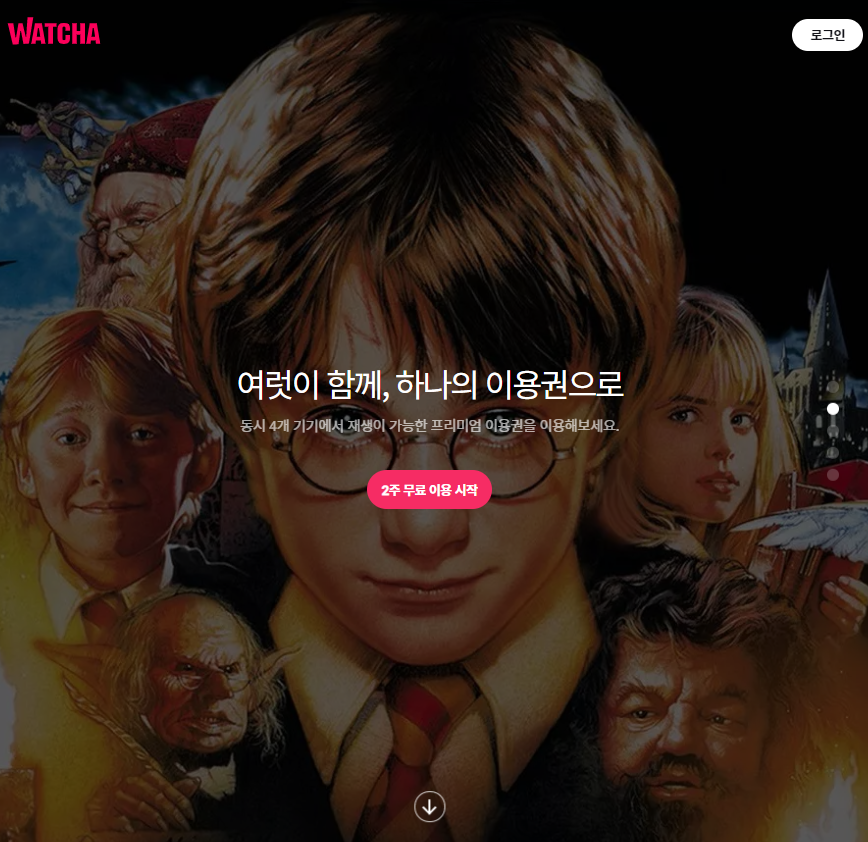
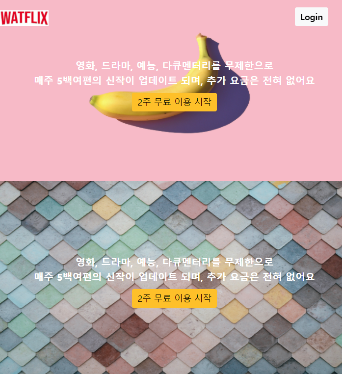

# Clone_Webpage_왓챠

### 1. 개요

HTML, CSS, Bootstrap을 사용하는 데 익숙해지기 위해 오늘부터 Clone Coding을 꾸준히 진행해보려 한다. 

첫 번째로 [WATCHA](https://watcha.com/) 사이트를 clone할 예정이다.

 

### 2. 진행상황

#### 2.1 [210206] 첫 번째 시간

##### 2.1.1 진행상황

 

nav 태그와 image와 text를 담는 부분까지 구현해보았다. 

근데 아직 미완성이다. 

단지 구조를 맞추기 위해서 코드를 짠 것 같다.

##### 2.1.2 어려웠던 점 / 문제점

- responsiveness 실험을 할 때 image와 text가 동시에 확대, 축소 되는 것이 아니라 따로 노는 부분을 해결하는 데 어려움을 느꼈다.	
  - 그래서 image의 width, image와 text가 공유하고 있는 부모 태그의 width를 고정시켜서 해결해보려 했다.
  - 근데 이게 정답은 아닌 것 같다... 왓챠의 화면을 정지시켜놓고 그것을 따라 만드는 느낌
- navbar의 길이 설정을 어떻게 해줘야할 지 모르겠다.  responsiveness 실험을 할 때 화면을 줄이면 Login button이 갑자기 껑충 왼쪽으로 뛴다....

##### 2.1.3 다음 진행 방향
- `2주 무료 이용 시작`을 클릭하면 다른 페이지로 넘어갈 수 있게 구현
- `2주 무료 이용 시작.html` 간이 제작
- 이미지를 넘길 수 있는 버튼 구현

##### 2.1.4 느낀점

- 이미지안에 텍스트를 배치하는 게 생각보다 너무 어려웠다.
- 그래도 꾸준히 계속 조금씩이라도 해나갈 예정이다. 

